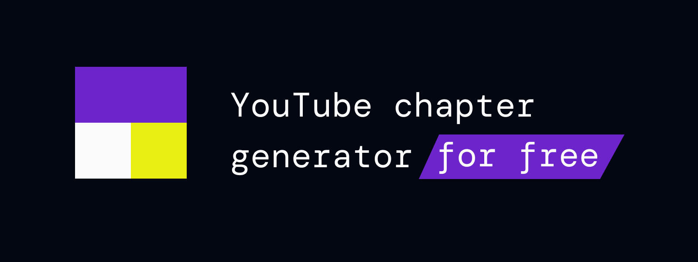
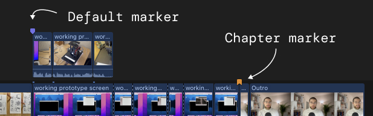

[➡️ https://yt-chapter-generator.peter-kuhmann.de](https://yt-chapter-generator.peter-kuhmann.de)

This web tool allows you to generate a YouTube chapter description
based on your Final Cut Pro poject markers.

Just export your FCP project to XML, select the file, and you can
copy the chapter description.

# Table of contents

<!-- TOC -->
* [Table of contents](#table-of-contents)
* [Service URL](#service-url)
* [Supported FCP markers](#supported-fcp-markers)
* [Tech stack](#tech-stack)
* [Related Apple docs](#related-apple-docs)
* [Problem found](#problem-found)
<!-- TOC -->

# Service URL
[➡️ https://yt-chapter-generator.peter-kuhmann.de](https://yt-chapter-generator.peter-kuhmann.de)

# Supported FCP markers
- Default markers (blue ones)
- Chapter markers (orange ones)

# Tech stack
- Next.js
- React
- Tailwind
- Zip.js
- Vercel

# Related Apple docs
While building this tool, the following docs about the FCP XML export were very helpful:
- [Docs: Element asset-clip 🔗](https://developer.apple.com/documentation/professional_video_applications/fcpxml_reference/story_elements/asset-clip)
- [Docs: Element marker 🔗](https://developer.apple.com/documentation/professional_video_applications/fcpxml_reference/story_elements/marker)
- [Docs: Element chapter-marker 🔗](https://developer.apple.com/documentation/professional_video_applications/fcpxml_reference/story_elements/chapter-marker)
- [Docs: attributes Docs 🔗](https://developer.apple.com/documentation/professional_video_applications/fcpxml_reference/story_elements/timing_attributes)

# Problem found

Please open a GitHub issue OR send a mail to [info@peter-kuhmann.de](mailto:info@peter-kuhmann.de).